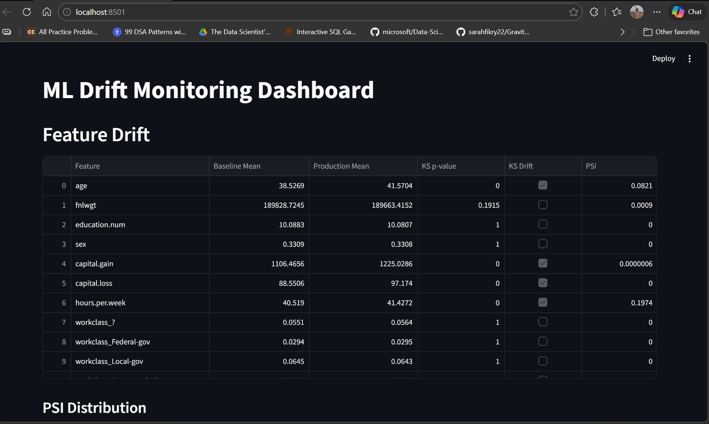
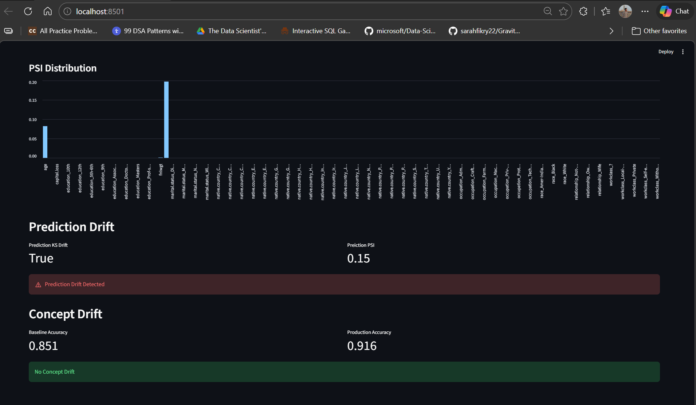

# ML Drift Monitoring DashBoard 

## Overview
This project implements a **Machine Learning Drift Monitoring Framework** for tabular datasets.  
It detects **data drift, prediction drift, and concept drift** in production environments and provides a monitoring dashboard for visualization.

Drift monitoring is an important part of **MLOps**, ensuring that deployed models continue to perform reliably as data changes over time.

---

## Features
- Detect **Feature/Data Drift** using:
  - Kolmogorov–Smirnov Test (KS Test)
  - Population Stability Index (PSI)
- Detect **Prediction Drift** by comparing model prediction distributions
- Detect **Concept Drift** using model performance degradation
- Generate **drift reports**
- Interactive **Streamlit monitoring dashboard**
- Modular and reusable architecture

---

## Types of Drift Detected

### 1. Data Drift (Feature Drift)
Occurs when the **distribution of input features changes** between training data and production data.

Example:

```
Training Age Distribution: 20–40
Production Age Distribution: 40–70
```

Detected using:
- KS Test
- PSI

---

### 2. Prediction Drift
Occurs when the **distribution of model predictions changes**.

Example:

```
Training Predictions: mostly 0.2–0.4
Production Predictions: mostly 0.7–0.9
```

Detected by comparing prediction probabilities between training and production data.

---

### 3. Concept Drift
Occurs when the **relationship between features and the target variable changes**, causing model performance degradation.

Example:

```
Baseline Accuracy: 0.84
Production Accuracy: 0.62
```

Detected by monitoring **accuracy drop** relative to baseline performance.

---

## Project Structure

```
ml-drift-monitor/

data/
    train.csv
    production.csv

src/
    preprocessing.py
    train_model.py
    ks_test.py
    psi_test.py
    drift_detector.py
    prediction_drift.py
    concept_drift.py

models/
    model.pkl

reports/
    drift.json
    prediction_drift.json
    concept_drift.json
    baseline_stats.json
    baseline_metrics.json

dashboard/
    app.py

main.py
requirements.txt
README.md
```

---

## Installation

Clone the repository:

```
git clone https://github.com/YOUR_USERNAME/ml-drift-monitor.git
cd ml-drift-monitor
```

Install dependencies:

```
pip install -r requirements.txt
```

---

## How to Run the Project

### 1. Train the Model

```
python src/train_model.py
```

This will generate:

```
models/model.pkl
models/baseline_metrics.json
```

---

### 2. Generate Baseline Statistics

```
python src/baseline.py
```

Creates:

```
models/baseline_stats.json
```

---

### 3. Simulate Production Drift

```
python src/simulate_drift.py
```

Creates:

```
data/production.csv
```

---

### 4. Detect Feature Drift

```
python src/drift_detector.py
```

Creates:

```
reports/drift.json
```

---

### 5. Detect Prediction Drift

```
python src/prediction_drift.py
```

Creates:

```
reports/prediction_drift.json
```

---

### 6. Detect Concept Drift

```
python src/concept_drift.py
```

Creates:

```
reports/concept_drift.json
```

---

### 7. Launch Monitoring Dashboard

```
streamlit run dashboard/app.py
```

The dashboard visualizes:

- Feature drift metrics
- PSI scores
- Prediction drift
- Concept drift
- Baseline vs production comparisons

---

## Monitoring Dashboard

The system includes a **Streamlit dashboard** for real-time drift monitoring.

It visualizes:

- Feature drift summary
- PSI score distribution
- Prediction drift status
- Concept drift alerts
- Baseline vs production comparisons

---

## Dashboard Screenshot

Below is a preview of the monitoring dashboard:





---

## Example Drift Report

Example output from feature drift detection:

```json
{
  "tenure": {
    "baseline_mean": 32.4,
    "production_mean": 45.1,
    "ks_test": {
      "ks_statistic": 0.1378,
      "p_value": "1.35e-58",
      "drift_detected": true
    },
    "psi": 0.27
  }
}
```

---

## Technologies Used

- Python
- Pandas
- NumPy
- Scikit-learn
- SciPy
- Streamlit
- Joblib

---

This project demonstrates practical implementation of **ML monitoring and drift detection systems** used in real-world machine learning deployments.# ML-Drift-Monitoring-Dashboard-MLOps-Project-
